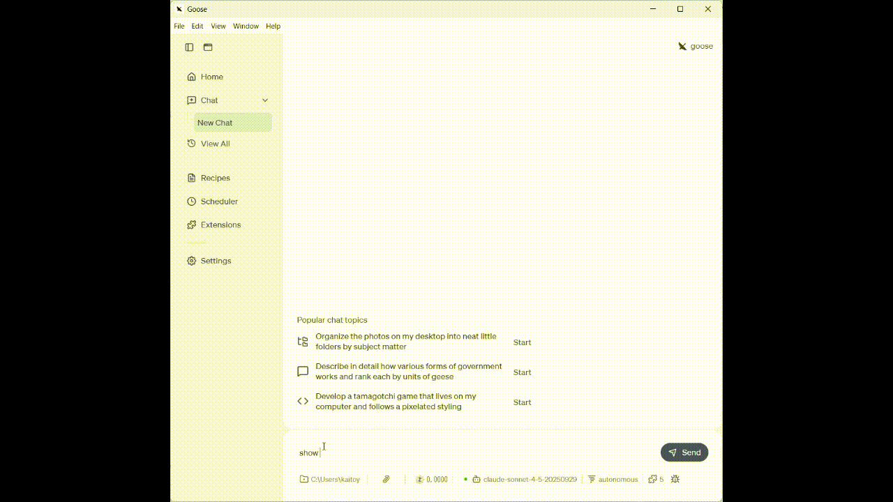

# NASA Images MCP Server

A project to search NASA's image library using an MCP server and display images in an interactive UI.

**🌟 Features:**
- **Dual Transport Support**: Supports both stdio and Streamable HTTP transport
- **Image Search**: Search by keywords using NASA's Images API
- **Interactive UI**: Beautiful image viewer using MCP Apps Pattern
- **Image Navigation**: Display search results sequentially
- **Session Management**: Stateful session management



## Requirements

- Node.js 18 or higher
- npm or yarn
- NASA API Key (get free at [nasa.gov/api](https://api.nasa.gov/))

## Installation

1. Clone the repository:
```bash
cd nasa-images-mcp-server
```

2. Install dependencies:
```bash
npm install
```

3. Set up environment variables:
```bash
cp .env.example .env
```

Edit the `.env` file to configure your NASA API key:
```env
NASA_API_KEY=your_api_key_here
PORT=3000
```

4. Build:
```bash
npm run build
```

## Getting a NASA API Key

1. Visit [https://api.nasa.gov/](https://api.nasa.gov/)
2. Enter your name and email address in the form
3. The API key will be sent to your email immediately
4. Add it to your `.env` file

**Rate Limits:**
- DEMO_KEY: 30 requests/hour, 50 requests/day
- Registered key: 1000 requests/hour

## Usage

### stdio Mode (Recommended for MCP Clients like Claude Desktop)

In stdio mode, the server communicates via stdin/stdout — no HTTP server is started. Logs are written to stderr.

#### Run with npx (no installation required)

```bash
npx @kaitoy/nasa-images-mcp-server --stdio
```

#### Run from local build

Pass the `--stdio` flag to use stdio transport:

```bash
node build/index.js --stdio
```

#### Claude Desktop Configuration

**Using npx** (recommended):

```json
{
  "mcpServers": {
    "nasa-images": {
      "command": "npx",
      "args": ["-y", "@kaitoy/nasa-images-mcp-server", "--stdio"],
      "env": {
        "NASA_API_KEY": "your_api_key_here"
      }
    }
  }
}
```

**Using local build**:

```json
{
  "mcpServers": {
    "nasa-images": {
      "command": "node",
      "args": ["/path/to/nasa-images-mcp-server/build/index.js", "--stdio"],
      "env": {
        "NASA_API_KEY": "your_api_key_here"
      }
    }
  }
}
```

### HTTP Server Mode

```bash
npm start
```

The server will start at `http://localhost:3000`.

### Start on a Different Port

```bash
PORT=3001 npm start
```

## About Transports

### stdio Transport

Suitable for local MCP clients (e.g., Claude Desktop) that launch the server as a subprocess.

- Communicates via stdin/stdout
- Single session per process
- No network configuration required

### Streamable HTTP Transport

The latest MCP HTTP transport protocol, suitable for remote or multi-client scenarios.

**Key Features:**
- ✅ **Stateful Sessions**: Issues a unique session ID for each client
- ✅ **SSE Support**: Supports push notifications from the server via Server-Sent Events
- ✅ **JSON-RPC over HTTP**: Communication via standard HTTP request/response
- ✅ **Session Management**: Automatic session lifecycle management

## Integration with MCP Clients

### Connecting with MCP Inspector (HTTP mode)

You can test the server using [MCP Inspector](https://github.com/modelcontextprotocol/inspector):

```bash
npx @modelcontextprotocol/inspector http://localhost:3000/mcp
```

### Connecting with MCP Inspector (stdio mode)

```bash
npx @modelcontextprotocol/inspector node /path/to/nasa-images-mcp-server/build/index.js --stdio
```

### Using with Custom MCP Clients

Steps to connect from a custom client:

1. **Initialize Request** (POST /mcp):
```bash
curl -X POST http://localhost:3000/mcp \
  -H "Content-Type: application/json" \
  -H "Accept: application/json, text/event-stream" \
  -d '{
    "jsonrpc": "2.0",
    "id": 1,
    "method": "initialize",
    "params": {
      "protocolVersion": "2024-11-05",
      "capabilities": {},
      "clientInfo": {
        "name": "my-client",
        "version": "1.0.0"
      }
    }
  }'
```

The response headers will include `mcp-session-id`.

2. **Subsequent Requests**:
```bash
curl -X POST http://localhost:3000/mcp \
  -H "Content-Type: application/json" \
  -H "Accept: application/json, text/event-stream" \
  -H "mcp-session-id: <your-session-id>" \
  -d '{
    "jsonrpc": "2.0",
    "id": 2,
    "method": "tools/list"
  }'
```

3. **SSE Stream** (GET /mcp):
```bash
curl -X GET "http://localhost:3000/mcp" \
  -H "mcp-session-id: <your-session-id>" \
  -H "Accept: text/event-stream"
```

## Endpoints

| Endpoint | Method | Description |
|----------|--------|-------------|
| `/` | GET | Server information and endpoint list |
| `/health` | GET | Health check (includes active session count) |
| `/mcp` | POST | JSON-RPC requests (initialization, tool calls, etc.) |
| `/mcp` | GET | SSE stream (for server notifications) |
| `/mcp` | DELETE | Close session |

## Available Tools

### 1. `search_nasa_images`

Search NASA's image library.

**Parameters:**
- `query` (string, required): Search query (e.g., "apollo 11", "mars rover")

**Usage Example (JSON-RPC):**
```json
{
  "jsonrpc": "2.0",
  "id": 3,
  "method": "tools/call",
  "params": {
    "name": "search_nasa_images",
    "arguments": {
      "query": "apollo 11 moon landing"
    }
  }
}
```

### 2. `get_next_image`

Display the next image from the current search results.

**Parameters:**
None

**Usage Example (JSON-RPC):**
```json
{
  "jsonrpc": "2.0",
  "id": 4,
  "method": "tools/call",
  "params": {
    "name": "get_next_image",
    "arguments": {}
  }
}
```

## Available Resources

### `nasa-image://current`

Get the URL of the currently displayed image.

**MIME Type:** `text/uri-list`

### `ui://nasa-images/viewer`

HTML UI resource for the image viewer.

**MIME Type:** `text/html;profile=mcp-app`

## Architecture

### stdio Mode

```
┌─────────────────────────────────────────────┐
│     MCP Client (Claude Desktop, etc.)       │
│                   ↕ stdin/stdout            │
└───────────────────┼─────────────────────────┘
                    │
┌───────────────────┼─────────────────────────┐
│  NASA Images MCP Server                     │
│  ┌────────────────┴──────────────────────┐  │
│  │  StdioServerTransport                 │  │
│  └───────────────────────────────────────┘  │
│  ┌───────────────────────────────────────┐  │
│  │  McpServer (MCP Apps Pattern)         │  │
│  │  - registerAppTool(search_nasa...)    │  │
│  │  - registerAppTool(get_next_image)    │  │
│  │  - registerAppResource(viewer UI)     │  │
│  │  - registerResource(image URL)        │  │
│  └───────────────────────────────────────┘  │
│  ┌───────────────────────────────────────┐  │
│  │  Session Manager                      │  │
│  │  - Manage search state per user       │  │
│  └───────────────────────────────────────┘  │
│  ┌───────────────────────────────────────┐  │
│  │  NASA API Client                      │  │
│  │  - Image search                       │  │
│  │  - Image URL retrieval                │  │
│  └───────────────────────────────────────┘  │
└───────────────────┼─────────────────────────┘
                    │ HTTPS
┌───────────────────┼─────────────────────────┐
│         NASA Images API                     │
│  https://images-api.nasa.gov/search         │
└─────────────────────────────────────────────┘
```

### HTTP Mode

```
┌─────────────────────────────────────────────┐
│     MCP Client (Inspector, Custom App)      │
│                                             │
│  ┌────────────────────────────────────────┐ │
│  │  HTTP Client                           │ │
│  │  - POST /mcp (JSON-RPC requests)       │ │
│  │  - GET /mcp (SSE stream)               │ │
│  └────────────────────────────────────────┘ │
│                   ↕                         │
└───────────────────┼─────────────────────────┘
                    │ HTTP/SSE
┌───────────────────┼─────────────────────────┐
│  NASA Images MCP Server (Express)           │
│  ┌────────────────┴──────────────────────┐  │
│  │  StreamableHTTPServerTransport        │  │
│  │  - Session management                 │  │
│  │  - JSON-RPC over HTTP                 │  │
│  │  - SSE for notifications              │  │
│  └───────────────────────────────────────┘  │
│  ┌───────────────────────────────────────┐  │
│  │  McpServer (MCP Apps Pattern)         │  │
│  │  - registerAppTool(search_nasa...)    │  │
│  │  - registerAppTool(get_next_image)    │  │
│  │  - registerAppResource(viewer UI)     │  │
│  │  - registerResource(image URL)        │  │
│  └───────────────────────────────────────┘  │
│  ┌───────────────────────────────────────┐  │
│  │  Session Manager                      │  │
│  │  - Manage search state per user       │  │
│  └───────────────────────────────────────┘  │
│  ┌───────────────────────────────────────┐  │
│  │  NASA API Client                      │  │
│  │  - Image search                       │  │
│  │  - Image URL retrieval                │  │
│  └───────────────────────────────────────┘  │
└───────────────────┼─────────────────────────┘
                    │ HTTPS
┌───────────────────┼─────────────────────────┐
│         NASA Images API                     │
│  https://images-api.nasa.gov/search         │
└─────────────────────────────────────────────┘
```

### Main Components

- **src/index.ts**: Express server and transport management
- **src/mcp-server.ts**: MCP server logic (tool and resource registration)
- **src/session-manager.ts**: Session management (search state persistence)
- **src/nasa-api.ts**: NASA API client
- **src/types.ts**: TypeScript type definitions

## Development

### Watch Mode

```bash
npm run watch
```

Automatically rebuilds when files change.

### Development Mode

```bash
npm run dev
```

Builds and immediately starts the server.

## Troubleshooting

### Port Already in Use

```
Error: listen EADDRINUSE: address already in use
```

**Solution**: Specify a different port:
```bash
PORT=3001 npm start
```

### "Cannot find module" Error

Run:
```bash
npm run build
```

to compile TypeScript.

### API Rate Limit Error

- If using `DEMO_KEY`, obtain your own API key from [api.nasa.gov](https://api.nasa.gov/)
- Limited to 30 requests per hour

### "Not Acceptable" Error

The client must accept both MIME types:
- `application/json`
- `text/event-stream`

```bash
curl -H "Accept: application/json, text/event-stream" ...
```

### Session Not Found

Save the `mcp-session-id` header returned after the initialization request and send it as the `mcp-session-id` header in subsequent requests.

## Security Notes

- This server has CORS enabled (for development)
- In production, implement proper CORS settings and rate limiting
- Manage NASA API keys via environment variables; do not hardcode them

## License

MIT

## References

- [Model Context Protocol Specification](https://modelcontextprotocol.io/)
- [MCP TypeScript SDK](https://github.com/modelcontextprotocol/typescript-sdk)
- [MCP Apps Extension](https://github.com/modelcontextprotocol/ext-apps)
- [Streamable HTTP Transport](https://modelcontextprotocol.io/specification/draft/transport/http)
- [NASA Images API](https://images.nasa.gov/docs/images.nasa.gov_api_docs.pdf)
- [NASA Open APIs](https://api.nasa.gov/)

## Contributing

Pull requests are welcome! Bug reports and feature requests are accepted via Issues.

## Support

If you encounter issues, please create an Issue or refer to the NASA API support page.
